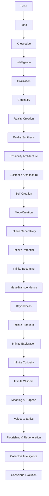
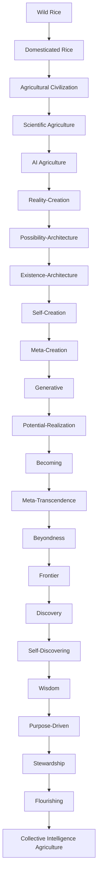
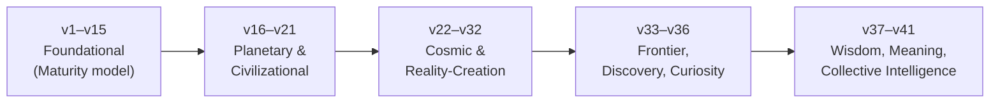

# 🌾 Rice Cultivation — UEEOS Evolution Map (v1 → v41)

> Consolidated from the *Agriculture → Rice Cultivation* validation series
> (`agriculture-rice-cultivation-v1.md` … `agriculture-rice-cultivation-v41.md`).
> Each version is a stress test of a UEEOS Master Specification using rice cultivation
> as the benchmark domain. Each version adds exactly **one** new capstone stage.

---

## Overview

The series tracks evolution along **two synchronized ladders**:

1. **The Conceptual Spine** — what reality / intelligence is becoming.
2. **The Rice Capstone Sequence** — what *agriculture* becomes at each tier.

Underneath both runs a single invariant **recursive engine** (see §E).

---

## A. The Master Conceptual Spine (as of v41)

```text
Seed → Food → Knowledge → Intelligence → Civilization → Continuity
 → Reality Creation → Reality Synthesis → Possibility Architecture
 → Existence Architecture → Self-Creation → Meta-Creation
 → Infinite Generativity → Infinite Potential → Infinite Becoming
 → Meta-Transcendence → Beyondness → Infinite Frontiers
 → Infinite Exploration → Infinite Curiosity → Infinite Wisdom
 → Meaning & Purpose → Values & Ethics → Flourishing & Regeneration
 → Collective Intelligence → Conscious Evolution
```



---

## B. The Rice Cultivation Capstone Sequence (as of v41)

```text
Wild Rice → Domesticated Rice → Agricultural Civilization
 → Scientific Agriculture → AI Agriculture
 → Reality-Creation → Possibility-Architecture → Existence-Architecture
 → Self-Creation → Meta-Creation → Generative → Potential-Realization
 → Becoming → Meta-Transcendence → Beyondness → Frontier
 → Discovery → Self-Discovering → Wisdom → Purpose-Driven
 → Stewardship → Flourishing → Collective Intelligence Agriculture
```



*(each named `… Agriculture`; the final stage is new in v41)*

---

## C. Version-by-Version Map

| Ver | Framework Focus | New Essence / Capstone |
|----|----------------|------------------------|
| **v1–v10** | *Evolution* (foundational) | Establishes the Level 0–10 maturity model (Reality → Observation → Data → Knowledge → Intelligence → Wisdom → Purpose → Action → Learning → Adaptation → Evolution); proves UEEOS is domain-agnostic |
| **v11** | Evolution | Reality-Synthesized Agriculture |
| **v12** | Evolution | Emergent Agriculture |
| **v13** | Evolution | Unified Adaptive Agriculture |
| **v14** | Evolution | Value-Aware Agriculture |
| **v15** | Evolution | (consolidation) |
| **v16** | Unified Field Theory | Unifies all layers into one field |
| **v17** | Predictive | Predictive Agriculture |
| **v18** | Adaptive Reality Engineering | Engineering reality, not just observing it |
| **v19** | Autonomous Civilization Operating System | Civilization-scale autonomy |
| **v20** | Planetary Intelligence & Stewardship | Planet-scale intelligence |
| **v21** | Universal Stewardship & Cosmic Continuity | Continuity beyond planet |
| **v22** | Universal Intelligence & Evolutionary Cosmos (UIECF) | Cosmos as evolving intelligence |
| **v23** | Meta-Intelligence & Reality Creation (UMIRCF) | Reality Creation |
| **v24** | Reality Synthesis & Infinite Possibility (URSIPF) | Reality Synthesis |
| **v25** | Possibility Architecture & Omniversal Design (UPAODF) | Possibility Architecture |
| **v26** | Existence Design & Recursive Universe | Existence Architecture |
| **v27** | Recursive Existence & Self-Creation (URESCF) | **Self-Creation** |
| **v28** | Infinite Recursion & Meta-Creation (UIRMCF) | Meta-Creation |
| **v29** | Infinite Emergence & Generative Cosmos (UIEGCF) | **Emergence Generating Emergence** |
| **v30** | Infinite Potential & Transcendent Evolution (UIPTEF) | **Potential Realizing Potential** |
| **v31** | Becoming & Infinite Horizon (UBIHF) | Becoming |
| **v32** | Infinite Horizons & Meta-Transcendence (UIHMTF) | Meta-Transcendence |
| **v33** | Beyondness & Infinite Meta-Horizon (UBIMHF) | **Horizons Creating Horizons** |
| **v34** | Infinite Frontier & Meta-Expansion (UIFMEF) | **Frontiers Creating Frontiers** |
| **v35** | Infinite Exploration & Discovery (UIEDF) | **Discovery Creating Discovery** |
| **v36** | Infinite Curiosity & Self-Discovery (UICSDF) | **Questions Creating Questions** / Self-Discovering Agriculture |
| **v37** | Infinite Wisdom & Reflective Intelligence (UIWRIF) | **Understanding Creating Understanding** |
| **v38** | Meaning, Purpose & Conscious Understanding (UMPCUF) | **Understanding Creating Meaning** |
| **v39** | Values, Ethics & Responsible Intelligence (UVERIF) | **Purpose Guided By Values** |
| **v40** | Flourishing, Harmony & Regenerative Civilization (UFHRCF) | **Stewardship Creating Flourishing** |
| **v41** | Conscious Evolution & Collective Intelligence (UCECIF) | **Many Minds Learning Together** / Collective Learning Creating Evolution |

---

## D. Phases of the Journey



---

## E. The Recurring Engine (invariant across all versions)

Every version reduces to one recursive loop — the actual "engine" the map traces:

```text
Unknown → Question → Curiosity → Exploration → Discovery
 → Knowledge → Reflection → New Questions → (repeat)
```


By **v41** this is reframed at collective scale:

```text
Individual Learning → Shared Learning → Collective Knowledge
 → Collective Intelligence → Collective Action → Collective Evolution
```

---

## F. Trajectory — Where the Map Points Next

The arc moves:

**Production → Knowledge → Intelligence → Curiosity → Wisdom → Meaning → Values → Flourishing → Collective Intelligence → Conscious Evolution.**

v41 explicitly sets up:

> **v42 = Universal Meta-Civilization & Planetary Consciousness Framework**

…a planetary-scale learning and stewardship system, with open gaps around:

- Planetary Intelligence Theory
- Meta-Civilization Architecture
- Planetary Stewardship Systems
- An "Earth Operating System"
- Civilization as a self-learning organism
