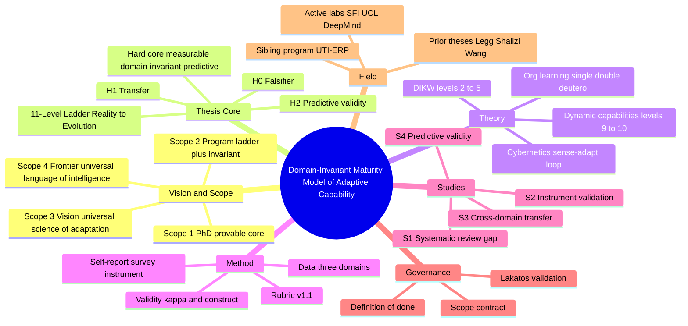
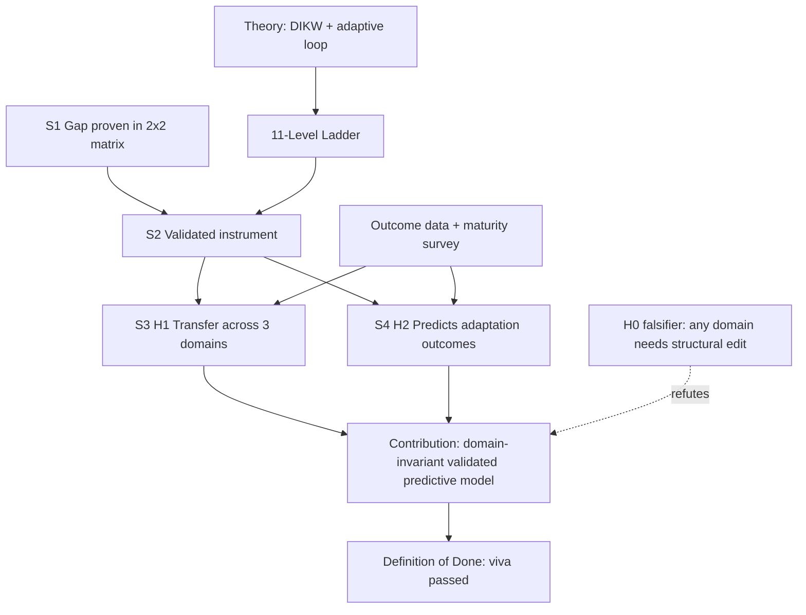
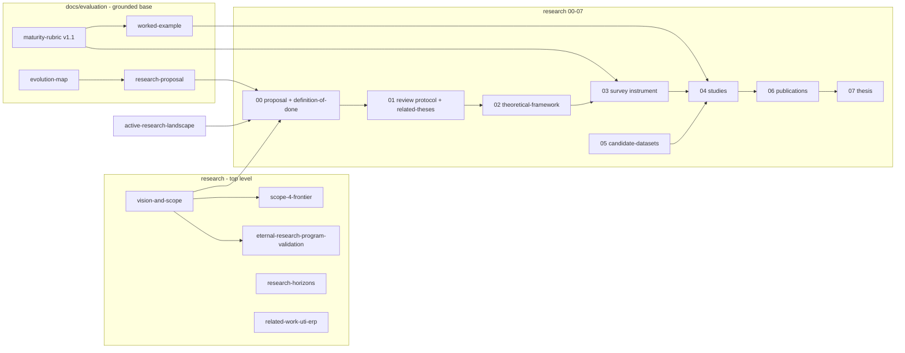

# Concept Map / Mind Map — PhD Program

*A single-page visual of the whole program: scopes, thesis core, theory, method,
studies, governance, and field. Mermaid renders in GitHub/VS Code; a text outline
follows for plain viewers.*

---

## 1. Mind map (whole program at a glance)

## 2. Logical dependency map (how the core connects)

## 3. Document map (where each file sits)

---

## 4. Text outline (plain-viewer fallback)

- **PhD Program — Domain-Invariant Maturity Model of Adaptive Capability**
  - **Vision & Scope** — scope 1 (PhD) → 2 (program) → 3 (vision) → 4 (frontier)
  - **Thesis Core**
    - Hard core: adaptive capability is measurable, domain-invariant, predictive
    - 11-Level Ladder: Reality → … → Evolution
    - Hypotheses: H1 transfer · H2 predictive validity · H0 falsifier
  - **Theory** — DIKW (L2–L5) + cybernetics loop + organizational learning (single/double/deutero) + dynamic capabilities (L9–L10)
  - **Method** — rubric v1.1 · survey instrument · 3-domain data · reliability (κ) + construct validity
  - **Studies** — S1 review (gap) · S2 instrument · S3 transfer · S4 prediction
  - **Governance** — scope contract · Lakatos validation · definition of done
  - **Field** — prior theses (Legg, Shalizi, Wang) · active labs (SFI, UCL, DeepMind) · sibling UTI-ERP

---

_Status: concept map v0.1 — regenerate when the study plan or scope structure changes._
